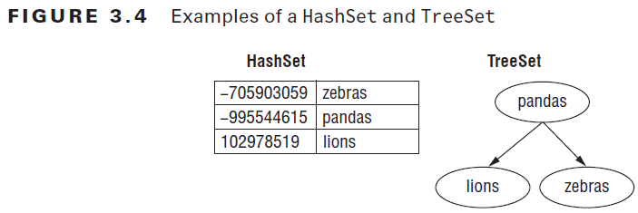

# Chapter 3 - Generics and Collections
## Reviewing OCA Collections
- **ArrayList** implements List, which implements Collection which implements Iterable
    - Is an object that contains other object. It can't contain primitives
- **Array** is a built-in data structure that contains other objects or primitives
- See package `oca_collections`

## Working with Generics
- Generics are type parameters for code
- Generics allow you to write and use parameterized types.
```
List<String> names = new ArrayList<String>();
names.add(new StringBuilder("Webby"); // Compile time error
// Without Generics there will be an exception at runtime if you only want to operate on Strings
```

### Generic classes
- Declare a **formal type parameter** in angle brackets: `public class Crate<T> {}` (see *custom_class* package)
- That generic Type `T` is available anywhere within the Crate class.
- When instantiating the class you tell the compiler what T should be for that particular Instance: `Crate<Elephant> elephantCrate = new Crate<>();`
    - The diamond operator <> tells Java that the generic type matches the declaration. So it would be equivalent to write `Crate<Elephant> elephantCrate = new Crate<Elephant>();`
Naming conventions:

| Letter       | Meaning                              |
|--------------|--------------------------------------|
| E            | Element                              |
| K            | Map Key                              |
| V            | Map Value                            |
| N            | Number                               |
| T            | Generic data type                    |
| S, U, V, ... | When multiple generic types are used |

### Generic interfaces
- Interfaces can also declare a formal type parameter. (see *custom_interface* package)
- Classes implementing that interface have 3 ways to deal with the generic type:
    1. Specify the generic type in the class. And implement the methods with that specified type.
    1. Make the class itself generic and implement the method with the generic type specified in the class. (The name of the generic type can be the same as in the interface)
    1. Not use generics at all (Not recommended!) - Replace the generic type with *Object*
    
### Generics behind the scenes & limitations
Behind the scenes the compiler replaces all Generics with *Object*. 
This way there is only one class file needed for a class that uses generics. That process is called **type erasure**.
The compiler then adds the relevant casts for your code to work with the actual specified types.
- Most limitations of Generics are due to type erasure. You can't do the following:
    - Call the constructor: new T() is not allowed because at runtime it would be 'new Object()'
    - Create an array of that static type: Because you would be creating an Array of Objects
    - Call instanceof: Because at runtime List\<Integer> and List\<String> look the same because of type erasure
    - Use primitive type as generic parameter: However you can just use the wrapper class
    - Create a static variable as generic type parameter: Because the type is linked to the instance of the class

### Generic Methods
- Before the return type we declare the formal type parameter (e.g. *\<T>*): 
    - `public static <T> Crate<T> ship(T t) {...}`
    - Formal type parameter \<T>
    - Return type Crate\<T>
    - Parameter type T
- The formal type parameter has to be specified on the method unless it can obtain the generic formal type parameter from the class/ interface
- Example see the *generic_methods* package

### Bounds
- Bounded wildcards restrict which types we can use for the formal type parameter
- A **bounded parameter type** is a generic type that specifies a bound for the generic
- A **wildcard generic type** is an unknown generic type represented with a question mark '**?**'

| Type of bound             | Syntax         | Example                                                          |
|---------------------------|----------------|------------------------------------------------------------------|
| Unbounded wildcard        | ?              | List<?> l = new ArrayList\<String>();                             |
| Wildcard with upper bound | ? extends type | List<? extends Exception> l = new ArrayList\<RuntimeException>(); |
| Wildcard with lower bound | ? super typ    | List<? super Exception> l = new ArrayList\<Object>();             |

#### Unbounded Wildcards
- Represents any data type
- '?' is used to specify that any type is okay
- See *bounds.unbounded_wildcard* package

#### Upper-Bounded Wildcards
```List<? extends Number> list = new ArrayList<Integer>();```
- Any class that extends Number or Number itself can be used as the formal parameter --> e.g. Integer
- When working with upper bounds or unbounded wildcards in Lists, the List becomes logically immutable
    - Technically you can still remove elements to the list but not add elements
- See *bounds.upper_bounded_wildcard* package

#### Lower-Bounded Wildcards
- With a lower bound we say that we want an Object of that class or Objects that are a superclass or that class. 
    - ```List<? super String> list; // A list of String objects or objects that are a superclass of String```
- Lower-Bounded Wildcards are needed when trying to add different types of Lists (e.g. ```List<String> and List<Object>```)to the same method.
Explanation:

| Code                                                                             | Method compiles                          | Can pass a List\<String>                  | Can pass a List\<Object> |
|----------------------------------------------------------------------------------|------------------------------------------|-------------------------------------------|--------------------------|
| public static void addSound(List\<?> list) { list.add("quack"); }                | No (unbounded generics are immutable)    | Yes                                       | Yes                      |
| public static void addSound(List\<? extends Object> list) { list.add("quack"); } | No (upperbounded generics are immutable) | Yes                                       | Yes                      |
| public static void addSound(List\<Object> list)  { list.add("quack"); }          | Yes                                      | No (with generics, must pass exact match) | Yes                      |
| public static void addSound(List\<? super String> list) { list.add("quack"); }   | Yes                                      | Yes                                       | Yes                      |

#### Putting it all together
- The *bounds.examples* package sums the generic bound chapter up.

## Using Lists, Sets, Maps and Queues
- Collection = Group of objects contained in a single object
- **List** 
    - Ordered collection of elements 
    - Duplicates allowed 
    - Elements can be accessed by an int index
- **Set**
    - Collection without duplicates
- **Queue** 
    - Orders its elements in a specific order for processing.
    - Typically FiFo (First in First out) but other orders are possible e.g. LiFo (Last in First out)
- **Map**
    - The Elements in a Map are key/ value pairs
    - Maps keys to values. 
    - No duplicate keys allowed
- **Collection** is the root interface. List, Set and Queue implement that interface. 
Map doesn't implement the Collection interface but it is still considered a collection (note the lowercase) because it contains a group of elements.
The reason it doesn't implement Collection is because different methods are needed due to the key/ value pairs.

### Common Collection Methods
- The Collection Framework uses generics. 
- Provides a bunch of useful methods for working with lists, sets or queues
- See the *collections.common_methods* package
- **add()** --> `boolean add(E element)`
    - Inserts a new element into the Collection and returns whether it was successful 
    - E.g. returns true for Lists, but false when trying to add duplicates to a Set
- **remove()** --> `boolean remove(Object object)`
    - Removes a single (the first) matching value in the Collection and returns whether the element was successfully removed.
    - There is an overloaded remove method that uses int as the index to remove an element. Notice that that method might throw an IndexOutOfBoundsException.
- **isEmpty()** --> `boolean isEmpty()`
    - Looks at how many elements are in the Collection and returns true when the size is 0.
- **size()** --> `int size()`
    - Looks at how many elements are in the Collection and returns the amount of elements inside
- **clear()** --> `void clear()`
    - Discards all elements of the Collection. After that the Collection is empty and has a size of 0.
- **contains()** --> `boolean contains(Object object)`
    - Checks if a certain value is in the Collection.
    - Calls the `equals()` method on each element of the ArrayList to see if there are any matches. 

### Using the List Interface
- Used when you want an **ordered** collection that can contain **duplicate** entries. (That's what all List implementations have in common)
- Items can be retrieved and inserted at specific positions in the list based on an int index.
- Each element of the List has an index and that index begins with zero

#### Comparing List Implementations
**ArrayList**
- Like a resizable array
    - When adding elements, the ArrayList automatically grows
- You can look up any element in constant time (O(1))
- Adding or removing an element is slower
- ==> Use when you are reading more often than writing

#### Intermezzo - Big O Notation
- Is used to talk about the performance of algorithms
    - Let's you compare the order of magnitude (Grössenordnungsdifferenz) performance rather than the exact performance
- "n" is used to reflect the number of elements or size of the data
- The most common big O notation values:
- **O(1) - constant time** 
    - The size of the collection doesn't matter. The answer will always take the same amount of time to return.
    - E.g. returning the String literal "Panda" or returning the last element of an array
- **O(log n) - logarithmic time**
    - A logarithm is a mathematical function that grows much more slowly than the data size
        - E.g. log(8) at base 2 gives you 3 and log(1024) at base 2 gives you 10
    - Is much better than linear time
    - E.g. binary search because it doesn't look at the majority of the elements
- **O(n) - linear time**
    - The performance will grow linearly with respect to the size of the collection
    - E.g. looping through a list and returning the number of elements matching "Panda"
- **O(n²) - n squared time**
    - Code that has nested loops where each loop goes through the data takes n squared time.

**LinkedList**
- Implements both, List and Queue
    - Has all methods of List and additional methods to facilitate adding or removing from the beginning and/ or ending of the list.
- You can **access, add and remove from the beginning and end** of the list in constant time (O(1))
- Tradeoff: Dealing with the arbitrary (willkürlich) index takes linear time (O(n))
- Good choice when you'll be using the List as a Queue

#### Working with List Methods
- The methods in Lists are for working with indexes. Here the most common methods:

| Method                         | Description                                                  |
|--------------------------------|--------------------------------------------------------------|
| void add(E element)            | Adds element to end                                          |
| void add(int index, E element) | Adds element at index and moves the rest toward the end      |
| E get(int index)               | Returns element at index                                     |
| int indexOf(Object o)          | Returns first matching index or -1 if not found              |
| int lastIndexOf(Object o)      | Returns last matching index or -1 if not found               |
| void remove(int index)         | Removes element at index and moves the rest toward the front |
| E set(int index, E e)          | Replaces element at index and returns original               |

### Using the Set Interface
- Used when you don't want duplicate entries

**HashSet**
- Stores elements in a hash table
    - Uses the `hashCode()` method to retrieve the (unordered) objects more efficiently
- Adding elements has constant time - O(1)
- Checking if an element is in the set has constant time - O(1)
    - equals() is used to determine equality
    - hashCode() is used to know which bucket to look in for the element
    - Best case: All hash Codes of the objects are unique and Java has to call equals() on only one object
    - Worst case: All implementations return the same hashCode and Java has to call equals() on every element of the set anyway 
- Tradeoff: You lose the order in which you inserted the elements
- Most commonly used form of a Set

**TreeSet**
- Stores elements in a sorted tree structure
- Elements are always in a sorted order
    - Elements in a TreeSet need to implement the Comparable interface, otherwise an Exception is thrown
    - The reason is that TreeSet tries to sort the elements when added to the set. That doesn't work if the element added does'nt implement the compareTo method of the Comparable interface
- Tradeoff: Adding and checking if an element is present need logarithmic time: O(log n)
- TreeSet implements the Interface `NavigableSet` that lets you slice up the collection



#### Working with Set Methods
- See package *collections.sets*

#### NavigableSet Interface
- As said, can be used when working with TreeSets: `NavigableSet<Integer> set = new TreeSet<>();`

| Method         | Description                                                       |
|----------------|-------------------------------------------------------------------|
| E lower(E e)   | Returns greatest element that is < e, or null if no such element  |
| E floor(E e)   | Returns greatest element that is <= e, or null if no such element |
| E ceiling(E e) | Returns smallest element that is >= e, or null if no such element |
| E higher(E e)  | Returns smallest element that is > e, or null if no such element  |

### Using the Queue Interface
- Used when elements are added and removed in a specific order
- Commonly used for sorting elements prior to processing them
- By default a queue is assumed FIFO (first-in, first-out). The other common format is LIFO (last-in, first-out)

#### Comparing Queue implementations
**LinkedList**
- Earlier we thematized `LinkedList`. Beside being a list, it is also a double-ended queue
    - Double ended means that you can insert and remove elements from both the front and the back
    - LinkedList implements List and Queue (which is the advantage over ArrayDeque) but isn't as efficient as a "pure" queue
    - LinkedList works the exact same way as ArrayDeque

**ArrayDeque**
 - Is a "pure" double-ended queue
 - Stores its elements in a resizable Array
 - Is more efficient than a LinkedList
 - Beside the methods that come from the Collection interface, Deque offers a lot of methods. Those are the most important ones:

| Method             | Description                                                                                               | For queue | For Stack |
|--------------------|-----------------------------------------------------------------------------------------------------------|-----------|-----------|
| boolean add(E e)   | **Adds** an element to the **back of the queue** and returns true or throws an exception                  | Yes       | No        |
| E element()        | Returns **next element** or throws an exception if empty queue                                            | Yes       | No        |
| boolean offer(E e) | **Adds** an element to the **back of the queue** and returns whether successful                           | Yes       | No        |
| E remove()         | **Removes** and returns **next element** or throws an exception if empty queue                            | Yes       | No        |
| void push(E e)     | **Adds** an element to the **front of the queue**                                                         | Yes       | Yes       |
| E poll()           | **Removes** and returns **next element** or returns null if empty queue --> Removes the head of the queue | Yes       | No        |
| E peek()           | Returns **next element** or returns null if empty queue --> Returns the head of the queue                 | Yes       | Yes       |
| E pop()            | **Removes** and returns **next element** or throws an exception if empty queue                            | No        | Yes       |

- offer & add = Add elem to the back
- push = Add elem to the front
- peek & element = Head of the queue
- poll & remove/pop = Remove the head

- Except for push, all methods are available in the `Queue` interface as well. Push makes `ArrayDeque` a double-ended queue
- There are basically two sets of methods
    - One throws an exception when something goes wrong
    - The other uses a different return value when something goes wrong
    - offer, poll and peek methods are more commonly used than the ones with exceptions
- Examples see the `collections.queue` package

FIFO vs LIFO
- FIFO = Stack
    - push/ poll/ peek
- LIFO = Single-ended queue
    - offer/ poll/ peek
- ArrayDeque can be used as a Stack or a Queue

### Map
- Stores data in key value pairs
- Values are identified by an (unique) key
- Example: Contact list in a phone. You look up the name and get the phone number 
    - --> A persons name would be the key and the phone number the value

#### Comparing Map Implementations
**HashMap**
- Stores the keys in a hash table
- Uses the `hashCode()`method of the keys to retrieve their values more efficiently
    - Adding & retrieving the element by key have constant time - O(1) 
- Tradeoff: You lose the order in which you inserted the elements
    - Most of the time that is not a problem. If the order is needed you can use a `LinkedHashMap`

**TreeMap**
- Stores the keys in a sorted tree structure
- Advantage: Keys are always in sorted order
- Tradeoff: Adding and checking if a key is present take logarithmic time - O(log n)

#### Working with Map Methods
- Map doesn't extend `Collection` so the methods are specified on the `Map` interface
- Many methods use the generic type parameters `K` vor Key and `V` for Value

| Method                              | Description                                                      |
|-------------------------------------|------------------------------------------------------------------|
| void clear()                        | Removes all keys and values from the map.                        |
| boolean isEmpty()                   | Returns whether the map is empty.                                |
| int size()                          | Returns the number of entries (key/value pairs) in the map.      |
| V get(Object key)                   | Returns the value mapped by key or null if none is mapped.       |
| V put(K key, V value)               | Adds or replaces key/value pair. Returns previous value or null. |
| V remove(Object key)                | Removes and returns value mapped to key. Returns null if none.   |
| boolean containsKey(Object key)     | Returns whether key is in map.                                   |
| boolean containsValue(Object value) | Returns whether value is in map.                                 |
| Set keySet()                        | Returns *Set* of all keys.                                       |
| Collection values()                 | Returns *Collection* of all values.                              |

- See the `collections.map` package for examples with HashMap and TreeMap

### Comparing Collection types
- Comparing the characteristics of the different Collection Framework types:

| Type  | Can contain duplicate elements? | Elements ordered?                | Has keys and values? | Must add/ remove in specific order? |
|-------|---------------------------------|----------------------------------|----------------------|-------------------------------------|
| List  | Yes                             | Yes (by index)                   | No                   | No                                  |
| Map   | Yes (for values)                | No                               | Yes                  | No                                  |
| Queue | Yes                             | Yes (retrieved in defined order) | No                   | Yes                                 |

- Comparing the Collection attributes:

| Type                   | Java Collections Framework instance | Sorted? | Calls hashCode? | Calls compareTo? | Can contain nulls?                                           |
|------------------------|-------------------------------------|---------|-----------------|------------------|--------------------------------------------------------------|
| ArrayList              | List                                | No      | No              | No               | Yes                                                          |
| LinkedList             | List, Queue                         | No      | No              | No               | Yes                                                          |
| Stack (deprecated)     | List                                | No      | No              | No               | Yes                                                          |
| Vector (deprecated)    | List                                | No      | No              | No               | Yes                                                          |
| HashSet                | Set                                 | No      | Yes             | No               | Yes                                                          |
| TreeSet                | Set                                 | Yes     | No              | Yes              | No null elements  (makes sense because cant sort with nulls) |
| ArrayDeque             | Queue                               | No      | No              | No               | No null elements                                             |
| HashMap                | Map                                 | No      | Yes             | No               | Yes                                                          |
| TreeMap                | Map                                 | Yes     | No              | Yes              | No null keys  (makes sense because cant sort with nulls)     |
| Hashtable (deprecated) | Map                                 | No      | Yes             | No               | No null keys or values                                       |

Which data structures *don't* allow null values?
- TreeSet, TreeMap - Data structures that involve sorting do not allow null values (Makes sense - you can't compare to null values to sort)
- ArrayDeque - It has methods that use null as a meaning like poll(). It uses null to indicate that the collection is empty.
- Hashtable (No special meaning, just old and deprecated) 

Choosing the right collection type by a given description of a problem:
- Pick the top zoo map off a stack of maps
    - Solution: ArrayDeque
    - Reason: Description is of a last-in, first-out structure. So a Stack is needed which is a type of Queue. (Stack is deprecated so we use the better ArrayDeque)
- Sell tickets to people in the order they appear in the line & tell them their position in line
    - Solution: LinkedList
    - Reason: First-in, first-out data structure. So a Queue is needed. Since we also need indexes the only collection that meets both requirements is LinkedList. (Otherwise we could use the more efficient ArrayDeque)
- Write down the names of all elephants you see in the zoo so you can tell them to your friend's 3-year old every time she asks. The elephants do not have unique names.
    - Solution: ArrayList
    - Reason: There are duplicates --> List is needed. You will be accessing the list more often than updating it because the 3-year old will ask over and over. That's why an ArrayList is better than an LinkedList here.
- List the unique animals that you want to see at the zoo today
    - Solution: HashSet
    - Reason: Keyword unique --> Set is needed. There are no requirements on a sorted order so we use the most efficient Set.
- List the unique animals that you want to see at the zoo today in alphabetical order
    - Solution: TreeSet
    - Reason: Keyword unique --> Set is needed. This time we need to sort so we cannot use the HashSet.
- Look up animals based on a unique identifier
    - Solution: HashMap
    - Reason: Looking up by key so we need a Map. We have no requirements on ordering or sorting so we use the most efficient Map.   

### Comparator vs Comparable
- For numbers the default order is the numerical order
- For String objects, order is defined according to the Unicode character mapping
    - Numbers sort before letters & uppercase letters before lowercase letters
- See package `comparison` for the upcoming chapters

#### Comparable
- Interface that can be used to order objects of a class you wrote the way you want
```
public interface Comparable<T> {
    public int compareTo(T o);
}
```
- Returns 0 if the current object is equal to the argument
- Returns <0 (e.g. -1) if the current object is smaller than the argument
- Returns >0 (e.g. 1) if the current object is larger than the argument

compareTo() and equals() Consistency:
- When implementing Comparable, you introduce new business logic to determine equality.
- The `compareTo()` method returns `0` if two objects are equal
- The `equals()` method returns `true` if two objects ar equal
- These methods need to be consistent - when compareTo() returns 0, equals should return true
    - Otherwise not all collection classes behave predictably if the compareTo() and equals() methods are not consistent
    - If it doesn't make sense in your case to make them consistent, use the Comparator class instead for comparison.

#### Comparator
- Useful to sort objects that do not implement `Comparable` or when wanting to sort objects in different ways at different times.
- `Comparator` is a functional interface and commonly declared using a lambda
```
public interface Comparator<T> {
    int compare(T o1, T o2);
}
```
- The logic is similar to the `compareTo()` method from `Comparable`.
    - Returns <0 if o1 is smaller than o2 etc.

Comparision between Comparable and Comparator

| Difference                                        | Comparable | Comparator |
|---------------------------------------------------|------------|------------|
| Package name                                      | java.lang  | java.util  |
| Interface must be implemented by class comparing? | Yes        | No         |
| Method name in interface                          | compareTo  | compare    |
| Number of parameters                              | 1          | 2          |
| Common to declare using a lambda                  |            |            |

#### Searching and Sorting
- The Collections `sort` method uses the `compareTo()` method of the Comparable interface
    - Note that this only compiles if the class you try to sort is actually implementing Comparable
- You can also pass a Comparator to the `sort` method
    - The class you try to sort then doesn't have to implement Comparable because the logic from the Comparator's `compare` method is used for sorting

#### Additions in Java 8
- This section is about the changes in Java 8 such as method references and added methods to Collections

#### Using Method References
- *Method references* are a way to make the cort shorter
- Code that can be inferred can be left out so you just have to mention the name of the method
- See `java8_additions.MethodReferences`
- The `::` operator tells Java to pass the parameters automatically into the method

Quick intermezzo to understand the following examples: 
- Consumer takes 1 parameter & returns void. 
- Predicate takes 1 parameter & returns boolean.
- Supplier takes no parameter & returns any type.

Four formats for method references
1. Static methods
    - `Consumer<List<Integer>> methodRef = Collections::sort;`
    - sort is a static method in the Collections interface. Here the long version:
    - `Consumer<List<Integer>> lambda = l -> Collections.sort(l);`
1. Instance methods on a particular instance
   ```
   String str = "abc";
   Predicate<String> methodRef = str::startsWith;
   Predicate<String> methodRef = str::startsWith
   ```
1. Instance methods on an instance to be determined at runtime
    - `Predicate<String> methodRef = String::isEmpty;`
    - The method we want to call (isEmpty) is declared in String. It looks like a static method but isn't. In fact it is an instance method that doesn't take any parameters.
    Java uses the parameter supplied at runtime as the instance on which the method is called.
    - `Predicate<String> lambda = s -> s.isEmpty();`
1. Constructors
    - `Supplier<ArrayList<String>> methodRef = ArrayList::new;`
    - The constructor reference is a special type of method reference that uses new instead of a method and creates a new object.
    - `Supplier<ArrayList<String>> lambda = () -> new ArrayList<>();`

#### Removing Conditionally
- Examples on the following sections can be found in `java8_additions.NewMethods`
- In Collection: `default boolean removeIf(Predicate<? super E> filter)`
    - Removes all elements that match the specified predicate. Returns true if any elements were removed.
- Before we just had the ability to remove a specified object from a collection or the object at a specified index.

#### Updating all Elements
- In List: `default void replaceAll(UnaryOperator<E> o)`
    - Takes 1 parameter and returns a value of the same type
    - Let's you pass a lambda that is applied to each element in the list. The result replaces the current value of that element.

#### Looping through a Collection
- There are many approaches to looping through a Collection - Use an iterator, enhanced for loop, using a lambda, ...
- In Iterable: `default void forEach(Consumer<? super T> action)`
    - Performs the given action for each element

#### Using Java 8 Map APIs
**putIfAbsent**
- `default V putIfAbsent(K key, V value)`
    - The `put()` method just adds or updates the specific key value pair in a map
    - `putIfAbsent()` only adds the key value pair if the specified key is not already associated with a value (or updates if the associated value is null)

**merge**
- The `merge()` method allows adding logic to determine which value for a key should be used
- `default V merge(K key, V value, BiFunction<V, V, V> remappingFunction)` (simplified)
    - Key is not already associated with a value or associated with null --> Add key value pair
    - Key is already present --> Check the result of the passed BiFunction to determine the new value for that key
    - Returns the new value associated with that key
    - The remappingFunction is only called when there are two values to decide 
    - When nulls as values or missing keys are involved merge simply uses the new value
    - If the mapping function is called and returns null the key is removed from the map 

**computeIfPresent**
- `default V computeIfPresent(K key, BiFunction<K, V, V> remappingFunction)` (simplified)
    - If the specified key if found (and non-null) it calls the BiFunction to compute a new mapping given the key and its current mapped value.
    - Note that in this BiFunction we pass a key and value unlike the merge() function where two values are passed.
    - If the mapping function returns null, the key is removed from the map

**computeIfAbsent**
- `default V computeIfAbsent(K key, Function<K, V> mappingFunction)`
    - Basically the opposite of computeIfPresent()
    - The Function only runs if the key is absent or null
    - Since there is no value already in the map, a Function can be used instead of BiFunction
        - For the function we only pass the key as input and return the value 
    - If the mapping function returns null, the key isn't even added to the map

To sum up here a comparison between the behavior of merge(), computeIfPresent() and computeIfAbsent() in different scenarios:

| Scenario                  | merge                                                                | computeIfPresent                                           | computeIfAbsent                            |
|---------------------------|----------------------------------------------------------------------|------------------------------------------------------------|--------------------------------------------|
| Key already in map        | Result of function                                                   | Result of function                                         | No action                                  |
| Key not in map            | Add new value to map                                                 | No action                                                  | Result of function                         |
| Functional interface used | BiFunction (Takes existing value + new value. Returns the new value) | BiFunction (Takes key + existing value. Returns new value) | Function (Takes key and returns new value) |

| Key has        | Mapping function returns | merge                              | computeIfPresent                   | computeIfAbsent                                      |
|----------------|--------------------------|------------------------------------|------------------------------------|------------------------------------------------------|
| null value     | null                     | Remove key from map                | Do not change                      | Do not change                                        |
| null value     | Not null                 | Set key to mapping function result | Do not change                      | Add key to map with mapping function result as value |
| Non-null value | null                     | Remove the key from map            | Remove key from map                | Do not change                                        |
| Non-null value | Not null                 | Set key to mapping function result | Set key to mapping function result | Do not change                                        |
| Key not in map | null                     | Add key to map                     | Do not change                      | Do not change                                        |
| Key not in map | Not null                 | Add key to map                     | Do not change                      | Add key to map with mapping function result as value |
