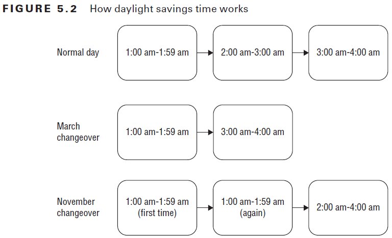

# Chapter 5 - Dates, Strings and Localization
## Working with Dates and Times
- Most date & time classes are inside `import java.time.*`

### Creating Dates and Times
- See package `basics.Creation`
- **LocalDate** contains just a date
    - No time, no time zone
    - Example: Birthday
- **LocalTime** contains just a time
    - No date, no time zone
    - Example: Midnight
- **LocalDateTime** contains date and time
    - No time zone
    - Example: Midnight on New Year's Eve
- **ZonedDateTime** contains date, time and a time zone
    - Example: Conference call at 9:00 a.m. EST
    - GMT/ UTC is used as time zone zero when discussing offsets. GMT and UTC are the same.
- All 4 classes have a static method `now()` e.g. `LocalDateTime.now();` gives you the current date and time

### Manipulating Dates and Times
- See package `basics.Manipulation`
- The Date and time classes are immutable 
    - Remember to assign the method results to a reference variable
    - It is common for the date an time methods to be chained

Here an overview of which methods can be called on which type:

|                           | LocalDate | LocalTime | LocalDateTime or ZonedDateTime |
|---------------------------|-----------|-----------|--------------------------------|
| plusYears/ minusYears     | Yes       | No        | Yes                            |
| plusMonths/ minusMonths   | Yes       | No        | Yes                            |
| plusWeeks/ minusWeeks     | Yes       | No        | Yes                            |
| plusDays/ minusDays       | Yes       | No        | Yes                            |
| plusHours/ minusHours     | No        | Yes       | Yes                            |
| plusMinutes/ minusMinutes | No        | Yes       | Yes                            |
| plusSeconds/ minusSeconds | No        | Yes       | Yes                            |
| plusNanos/ minusNanos     | No        | Yes       | Yes                            |

### Working with Periods
- See package `basics.PeriodPlayground`
- The `plus(TemporalAmount amountToAdd)` and `minus(TemporalAmount amountToSubtract)` methods expect a TemporalAmount. `Period` and `Duration` implement `TemporalAmount`.
- Period is for **years, months, weeks or days** (or a combination of these).
- The Period format when printing:
    - `Period.of(1, 2, 3); //P1Y2M3D` --> Creates a period of 1 year, 2 months and 3 days
    - P = Period
    - Y = Years (in this example 1 year)
    - M = Months (in this example 2 months)
    - D = Days (in this example 3 months)
    - Java only shows non-zero parts in the format. So `Period.ofWeeks(3);` would print P21D
- Period can be used with **LocalDate and LocalDateTime/ ZonedDateTime**
    - For LocalTime it throws an UnsupportedTemporalTypeException

### Working with Durations
- See package `basics.DurationPlayground`
- In contrast to Periods, Duration is intended for smaller units of time.
- Duration is used for **days, hours, minutes, seconds or nanoseconds**
- Duration works similar to Period. However here we operate with objects that have time.
- When printing the format is **PT** which stands for period of time
    - `Duration.ofMinutes(2); //PT2M` --> Creates a duration of 2 minutes
    - PT = period of time/ Duration
    - H = Hours
    - M = Minutes
    - S = Seconds and fractional seconds. The fractional seconds are also shown here: 
        - `Duration.ofMillis(1); //PT0.001S`
        - `Duration.ofNanos(1); //PT0.000000001S`
- Duration doesn't have a factory method that takes multiple units like Period does.
- However we can use the generic factory method `Duration of(long amount, TemporalUnit unit);`
    - `ChronoUnit` is an enum that implements TemporalUnit and can be used for all kinds of time/ date units
    - e.g. `Duration.of(1, ChronoUnit.HOURS); //hourly`
- ChronoUnit is great for determining how far apart two Temporal values are. (Temporal values are LocalDate, LocalTime, LocalDateTime/ ZonedDateTime)
    - `ChronoUnit.MINUTES.between(LocalTime.of(5, 15), LocalTime.of(6, 30)) //75`
    - Just be aware to not mix things up. E.g. you get an exception trying to determine the minutes between a LocalDate and a LocalTime
- Duration can be used with **LocalTime and LocalDateTime/ ZonedDateTime**
    - For LocalDate it throws an UnsupportedTemporalTypeException

Here a summary to memorize which Temporal classes can use which TemporalAmount

|                              | Can use Period? | Can use Duration? |
|------------------------------|-----------------|-------------------|
| LocalDateTime/ ZonedDateTime | Yes             | Yes               |
| LocalDate                    | Yes             | No                |
| LocalTime                    | No              | Yes               |

### Working with Instants
- See package `basics.InstantPlayground`
- The Instant class represents a specific moment in time in the GMT time zone
    - Convenient to use as timer (`Instant.now();` and then compare two instance with `Duration.between(now, later);`)
- You can convert a `ZonedDateTime` to an Instant.
    - Instant then gets rid of the time Zone and represents the DateTime as an Instant of time in GMT.
    - You cannot convert a LocalDateTime to an Instant unless you specify a TimeZone there.
- Instant allows you to add any unit day or smaller. 
    - `instant.plus(1, ChronoUnit.DAYS);`
    - Trying to add/subtract other units results in an UnsupportedTemporalTypeException

### Accounting for Daylight Savings Time
- See package `basics.DaylightSavingsTime`
- Some countries use daylight savings time.
    - Here the clocks are adjusted by an hour twice a year to make better use of sunlight.
    - The clock springs forward in spring (march) and falls back in fall (november)
    - Not all countries participate.
    - The countries that participate use different weekends for the change.
    


- When doing math with ZonedDateTimes that fall into this "time switch" Java behaves according to the image above.
- When trying to create a time that doesn't exist (e.g. 02:30 a.m. during the March changeover) Java switches over to the appropriate offset (in this case 03:30 a.m.)

## Reviewing the String class
- See package `string.StringPlaygrond`
- The String class is final and String objects are **immutable**
- Java optimizes by storing string literals in the *String pool*
- This lets us compare literals with `==`. However, you should always compare Strings with `equals()` so it works in all cases.
- Java allows String concatenation using the `+` operator
    - Concatenation goes from left to right
    - Remember that a String concatenated with anything else is a String: 
    ```
    String s1 = "1" + 2 + 3 // s1 is 123
    String s2 = 1 + 2 + "3" // s2 is 33
    ```
- Since String is immutable, it is inefficient when updating the value in a loop.
- `StringBuilder` is better for that scenario
    - StringBuilder is **mutable** and can change value and increase capacity
    - When multiple threads are updating the same object `StringBuffer` should be used
    - StringBuilder did not implement `equals()`, making the logic identical to comparing with `==`

Comparing String, StringBuilder and StringBuffer:

| Characteristic    | String | StringBuilder | StringBuffer |
|-------------------|--------|---------------|--------------|
| Immutable?        | Yes    | No            | No           |
| Pooled?           | Yes    | No            | No           |
| Thread-safe?      | Yes    | No            | Yes          |
| Can change size?  | No     | Yes           | Yes          |

## Adding Internationalization and Localization
- **Internationalization** is the process of designing your program so it can be adapted
    - Placing Strings in a property file
    - Using classes like `DateFormat` so that the right format is used etc.
    - Internationalization just means you could potentially support more than 1 language or country
- **Localization** means actually supporting multiple locales
    - A Locale is a specific geographical, political or cultural region
    - Like a Pair of language & country. 
    - Translating Strings to different languages
    - Outputting dates & numbers in the correct format for each Locale
- Abbreviation for internationalization & localization: **i18n** and **l10**

### Picking a Locale
- See package `i18n_and_l10n`
- The `Locale` class is in the `java.util` package
- Format of Locales:
    - Example: `fr` or `en_US`
    - First: Lowercase language code (mandatory)
    - Second: underscore (optional)
    - Third: Uppercase country code (optional)
- Ways to create a Locale:
    ```
    Locale de = Locale.getDefault(); // e.g. de_DE
    Locale us = Locale.US; // en_US    
    Locale fr = new Locale("fr"); // fr
    Locale us2 = new Locale.Builder().setRegion("US").setLanguage("en").build(); // en_US
    ```
